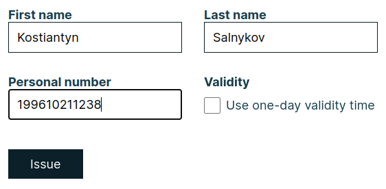
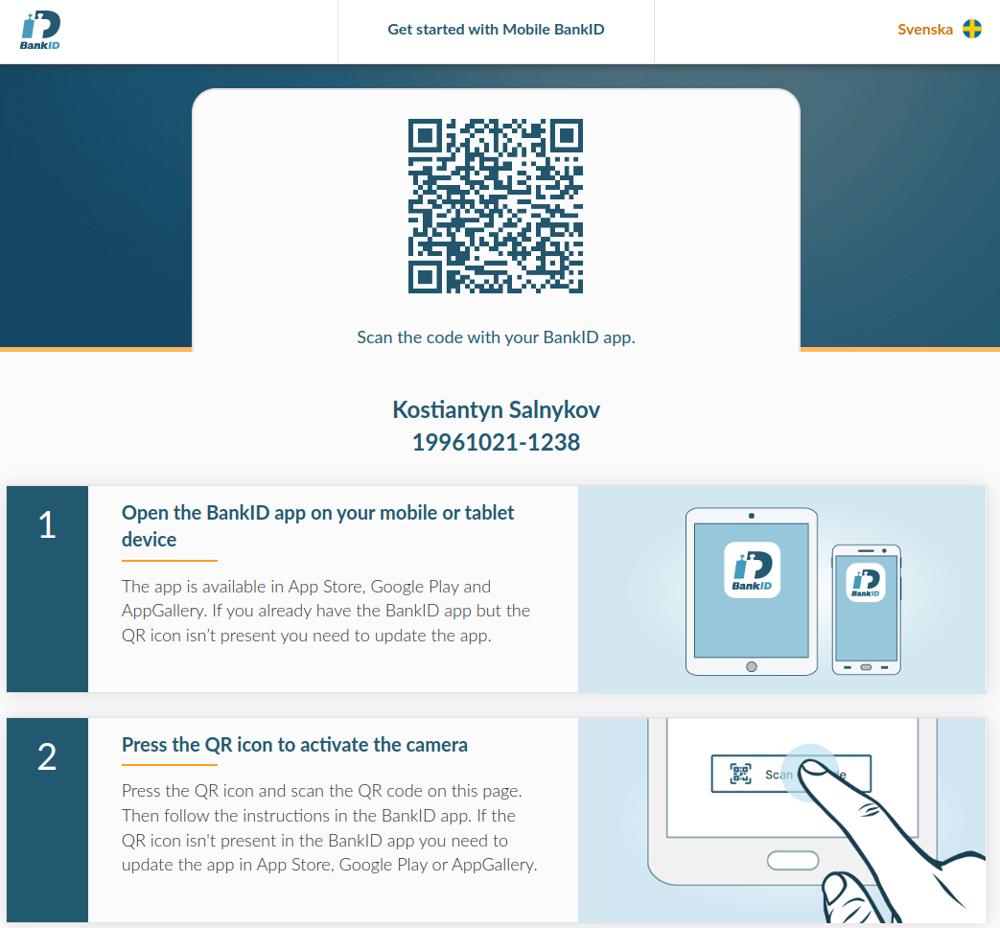

# Setup BankID 🔧

## Prepare test environment
### Test certificates 🧾
1. Goto [https://www.bankid.com/en/utvecklare/test](https://www.bankid.com/en/utvecklare/test){target=_blank}
2. Click "Download ⬇"
3. You'll get `.p12` file
4. To parse `key.pem` from it, use this command:
    ```{.terminal linenums="0"}
    openssl pkcs12 -in <FILE>.p12 -out key.pem -nocerts -nodes -legacy -passin 'pass:<PASSWORD>'
    ```
   
    Where `-in` must be a filename and path to `.p12` file, password `-passin 'pass:<PASSWORD>'`
    !!! example
        ```{.terminal linenums="0"}
        openssl pkcs12 -in FPTestcert4_20220818.p12 -out key.pem -nocerts -nodes -legacy -passin 'pass:qwerty123'
        ```
        This command will produce `key.pem` file

    !!! tip
        Usually test password for BankID `.p12` file is: `qwerty123`

5. To parse `cert.pem` from it, use this command:
    ```{.terminal linenums="0"}
    openssl pkcs12 -in <FILE>>.p12 -out cert.pem -clcerts -nokeys -legacy -passin 'pass:<PASSWORD>'
    ```

    !!! example
        ```{.terminal linenums="0"}
        openssl pkcs12 -in FPTestcert4_20220818.p12 -out cert.pem -clcerts -nokeys -legacy -passin 'pass:qwerty123'
        ```
        This command will produce `cert.pem` file

6. Copy inner certificate and key data to your environment variables or `.env` file, for example:
??? example "Example of `.env` file"
    ```{.dotenv linenums="0"}
    --8<-- "docs/includes/.env"
    ```

### Test account 💼

Here is a guide: [Get BankID for test](https://www.bankid.com/en/utvecklare/test/skaffa-testbankid/test-bankid-get){target=_blank}

#### Issue personal code
!!! tip
    Use this method when you set up your environment for the first time.
    Otherwise, use this methods [mobile](#login-with-mobile-app) or [desktop](#login-with-desktop-app).

1. Goto [https://demo.bankid.com/ordercode](https://demo.bankid.com/ordercode){target=_blank}
2. Fill form with your data (organization, email, project, fist name, last name)
    
    !!! warning "Organization email"
        Email should be a corporate, emails with `@gmail.com` domain wouldn't work❗
    
    

3. Goto your corporate email, you'll obtain a test 30-days trial code.

#### Login with personal code
1. Use this code to log in [https://demo.bankid.com/logincode](https://demo.bankid.com/logincode){target=_blank}
    
2. It's all, now you'll be able to set up Mobile / Desktop BankID environments.

#### Login with mobile app
This is method to log in to test account using mobile app and QR code.
!!! tip
    Use this method when you already set up your test account via personal code [Issue personal code](#issue-personal-code).

1. Go to [https://demo.bankid.com/logintest](https://demo.bankid.com/logintest){target=_blank}
2. Open your BankID test app and scan QR code.

    !!! warning
        Mobile app should be configured, read here [Mobile test environments](#mobile-test-environments).

#### Login with desktop app
This is method to log in to test account using desktop app.
!!! tip
    Use this method when you already set up your test account via personal code [Issue personal code](#issue-personal-code).

1. Go to [https://demo.bankid.com/logintest](https://demo.bankid.com/logintest){target=_blank}
2. Click "Alternative: Start BankID Security Application on this device.".

    !!! warning
        Mobile app should be configured, read here [Mobile test environments](#mobile-test-environments).

### Mobile test environments

#### Test Android app 📱
Here is a guide: [BankID test configuration](https://www.bankid.com/en/utvecklare/test/skaffa-testbankid/testbankid-konfiguration){target=_blank}

1. Install BankID app from your app store.

    {width="200"}

2. Enable "airplane mode".
3. Open BankID app (you'll be notified that is no connection, click "OK").
    
    3.1 Click "⚙ Settings".
    
    3.2 Click "About BankID".
    
    3.3 Make a "long press" on the heading `Error information` in the input dialog enter `kundtest` and save.

    {width="200"}
    {width="200"}
    {width="200"}
    !!! note
        If everything is "OK", it appears `CUST` after the Version.

4. Exit app, and also close it from background.
5. Disable "airplane mode".
6. Done.

#### Test iOS app 📱

1. Uninstall any existing version of BankID Security App and then reinstall it from App Store.

2. In Settings --> BankID --> Developer --> Server, enter `cavainternal.test.bankid.com`.

3. Done, BankID Security App will connect to the ^^test server^^.

!!! note
    Please note that the app must be uninstalled/reinstalled to be restored for the production environment.

!!! warning "TODO Screenshots"
    If you have an iPhone you can help to document it with screenshots (Contributors welcome).

### Desktop test environments

#### Test Windows app 🖥

1. [Download](https://install.bankid.com/api/file-download/Win){.md-button} windows BankID desktop application ([extra link](https://install.bankid.com/Download/PostDownload/Win){target=_blank})
2. Install it.
3. Run & close application.
4. Go to this path:
    C:\Users\\**USER_NAME**\AppData\Roaming\BankID\Config
    
    where **USER_NAME** - your Window's user.

5. Create file with name `CavaServerSelector.txt`
6. Write `kundtest` inside file and save it.
7. Open application, navigate to: "File" --> "Preferences" --> "Info for support" --> "Check connections" --> click "Check".

    You should get:

    - BankID server: OK
    - Update server: OK

    

8. Done.


#### Test MacOS app 💻

!!! warning "TODO"
    If you have a Macbook, you can help to document it with screenshots (Contributors welcome).

### Generate personal number (customizable)

1. Goto [Personal number generator](https://tedeh.net/tools/generator-for-swedish-personnummer/){target=_blank}
2. Select "Output format" as "YYYYMMDDNNNN".
3. Select your gender.
4. Fill out "Date of birth".
!!! example "Example"
    

### Generate random personal number with (fejk.se)

1. Generate personal number at: [https://fejk.se/](https://fejk.se/){target=_blank}
2. Get date of birth (without dashes). 
3. Get latest 4 digits of personnummer. 
4. Concatenate it without dashes.
!!! example
    1) Date of birth `1996-10-21` --> `19961021` (remove dashes)

    2) End of personal number `-1238` --> `1238` (removed dash)

    3) Result `19961021` + `1238` --> `199610211238` (must be 12 digits length)
    


### Issue BankID for test
1. Login to Demo Bank.

    !!! tip
        First time login: [personal code](#login-with-personal-code).
        
        Subsequent time login: [mobile](#login-with-mobile-app), [desktop](#login-with-desktop-app).

2. Click selected button under "Issue BankID for Test".

    !!! tip

        + "^^Mobile BankID^^" - for mobile 📱;
        + "^^BankID on file^^" - for desktop 🖥;

    

3. Fill data into fields (first name, last name, personal number).

        

    !!! tip
        You can use random first name and last name.

4. Click "Issue" and proceed with connection section, depends on your choice (mobile or desktop).

### Connect with Android 📱

Before start: [requirements](#connect-test-app-to-bankid-test-account)

1. Click "Issue" under "Mobile BankID" form.
    

2. It will open modal window with QR code.
    

3. Open BankID app.
4. Click "New BankID".

    {width="200"}

5. It will open scanner, scan QR code inside modal window.
    
    Success screen at mobile:
    
    {width="170"}
    
    Success screen at modal:
    
    
    
6. You can enable fingerprint to easy approve BankID confirmation.
    
    {width="170"}
    {width="170"}
    {width="170"}
    {width="170"}
    {width="170"}

7. You can check new test BankID connection inside your "Settings" under the BankID tab.
    
    !!! note
        P.S. Also your main screen now will have "QR code" button instead of "New BankID"
    {width="170"}
    {width="170"}

### Connect with iOS 📱

!!! warning
    If you have an iPhone you can help to document it with screenshots (Contributors welcome).

### Connect with Windows 🖥

Before start: [requirements](#connect-test-app-to-bankid-test-account)

1. Click "Issue" under "BankID on file" form.
    
    
2. Click "Open BankID issuing".
3. It will open modal window with QR code.
    

    Click "I have the most recent BankID application, proceed without installation >"

4. Click "Continue >".
    

5. Click "Start" inside Start the program modal.
    

6. You will be prompted to set password. It should be secure enough.

7. Close the modal or click "Close" button.
    

8. Inside BankID Secure Application you'll get new record about BankID connection.
    

9. Done. Now you can test login with BankID at Windows Desktop.


### Connect with MacOS 💻

!!! warning "TODO"
    If you have a Macbook, you can help to document it with screenshots (Contributors welcome).
