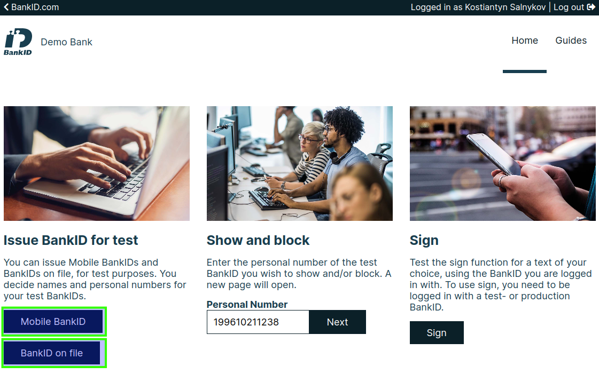
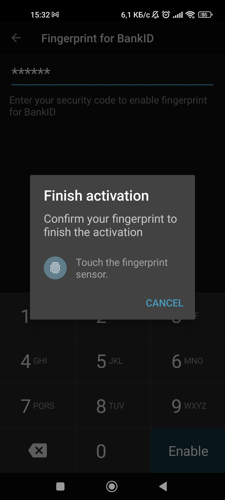

# Setup BankID 🔧

## Prepare test environment
### Test certificates 🧾
1. Goto [https://www.bankid.com/en/utvecklare/test](https://www.bankid.com/en/utvecklare/test){target=_blank}
2. Click "Download ⬇"
3. You'll get `.p12` file
4. To parse `key.pem` from it, use this command:
    ```{.terminal linenums="0"}
    openssl pkcs12 -in <FILE>.p12 -out key.pem -nocerts -nodes -legacy -passin 'pass:<PASSWORD>'
    ```
   
    Where `-in` must be a filename and path to `.p12` file, password `-passin 'pass:<PASSWORD>'`
    !!! example
        ```{.terminal linenums="0"}
        openssl pkcs12 -in FPTestcert4_20220818.p12 -out key.pem -nocerts -nodes -legacy -passin 'pass:qwerty123'
        ```
        This command will produce `key.pem` file

    !!! tip
        Usually test password for BankID `.p12` file is: `qwerty123`

5. To parse `cert.pem` from it, use this command:
    ```{.terminal linenums="0"}
    openssl pkcs12 -in <FILE>>.p12 -out cert.pem -clcerts -nokeys -legacy -passin 'pass:<PASSWORD>'
    ```

    !!! example
        ```{.terminal linenums="0"}
        openssl pkcs12 -in FPTestcert4_20220818.p12 -out cert.pem -clcerts -nokeys -legacy -passin 'pass:qwerty123'
        ```
        This command will produce `cert.pem` file

6. Copy inner certificate and key data to your environment variables or `.env` file, for example:
??? example "Example of `.env` file"
    ```{.dotenv linenums="0"}
    --8<-- "docs/includes/.env"
    ```

### Test account 💼
1. Goto [https://demo.bankid.com/](https://demo.bankid.com/){target=_blank}
2. Click "Generate code"
3. Fill form with your data (organization, email, project, fist name, last name)
    
    !!! warning "Organization email"
        Email should be a corporate, emails with `@gmail.com` domain wouldn't work❗
    
    

4. Goto your corporate email, you'll obtain a test 30-days trial code
5. Use this code to log in
    
6. It's all, now you'll be able to set up Mobile / Desktop BankID environments.

### Test Android app 📱
Here is a guide: [BankID test configuration](https://www.bankid.com/en/utvecklare/test/skaffa-testbankid/testbankid-konfiguration){target=_blank}

1. Install BankID app from your app store.

    {width="200"}

2. Enable "airplane mode".
3. Open BankID app (you'll be notified that is no connection, click "OK").
    
    3.1 Click "⚙ Settings".
    
    3.2 Click "About BankID".
    
    3.3 Make a "long press" on the heading `Error information` in the input dialog enter `kundtest` and save.

    {width="200"}
    {width="200"}
    {width="200"}
    !!! note
        If everything is "OK", it appears `CUST` after the Version.

4. Exit app, and also close it from background.
5. Disable "airplane mode".
6. Done.

### Test iOS app 📱

1. Uninstall any existing version of BankID Security App and then reinstall it from App Store.

2. In Settings --> BankID --> Developer --> Server, enter `cavainternal.test.bankid.com`.

3. Done, BankID Security App will connect to the ^^test server^^.

!!! note
    Please note that the app must be uninstalled/reinstalled to be restored for the production environment.

!!! warning "TODO Screenshots"
    If you have an iPhone you can help to document it with screenshots (Contributors welcome).

### Test Windows app 🖥

1. [Download](https://install.bankid.com/api/file-download/Win){.md-button} windows BankID desktop application ([extra link](https://install.bankid.com/Download/PostDownload/Win){target=_blank})
2. Install it.
3. Run & close application.
4. Go to this path:
    C:\Users\\**USER_NAME**\AppData\Roaming\BankID\Config
    
    where **USER_NAME** - your Window's user.

5. Create file with name `CavaServerSelector.txt`
6. Write `kundtest` inside file and save it.
7. Open application, navigate to: "File" --> "Preferences" --> "Info for support" --> "Check connections" --> click "Check".

    You should get:

    - BankID server: OK
    - Update server: OK

    

8. Done.


### Test MacOS app 💻

!!! warning "TODO"
    If you have a Macbook, you can help to document it with screenshots (Contributors welcome).

## Connect Test app to BankID test account
Here is a guide: [Get BankID for test](https://www.bankid.com/en/utvecklare/test/skaffa-testbankid/test-bankid-get){target=_blank}

1. Generate personal number at: [https://fejk.se/](https://fejk.se/){target=_blank}
    
    1.1 Get date of birth (without dashes).
    
    1.2 Get latest 4 digits of personnummer.
    
    1.3 Concatenate it without dashes.
    !!! example
        1) Date of birth `1996-10-21` --> `19961021` (remove dashes)
        
        2) End of personal number `-9876` --> `9876` (removed dash)
        
        3) Result `19961021` + `9876` --> `199610219876` (must be 12 digits length)

        

2. Login with 30-days code to demo BankID.
3. Click "Issue" under "Issue BankID for Test".

    
    3.1 Select one option:

    + "^^Issue Mobile BankID^^" - for mobile 📱;
        
    + "^^Issue BankID on file^^" - for desktop 🖥;
    
    3.2 Paste personal number into form, add first and last names.

        

    !!! tip
        You can use random first name and last name.

### Connect with Android 📱

Before start: [requirements](#connect-test-app-to-bankid-test-account)

1. Click "Issue" under "Issue Mobile BankID".
2. Click "Open BankID issuing".
    

3. It will open modal window with QR code.
    

4. Open BankID app.
5. Click "New BankID".

    {width="200"}

6. It will open scanner, scan QR code inside modal window.
    
    Success screen at mobile:
    
    {width="170"}
    
    Success screen at modal:
    
    
    
7. You can enable fingerprint to easy approve BankID confirmation.
    
    {width="170"}
    {width="170"}
    {width="170"}
    {width="170"}
    {width="170"}

8. You can check new test BankID connection inside your "Settings" under the BankID tab.
    
    !!! note
        P.S. Also your main screen now will have "QR code" button instead of "New BankID"
    {width="170"}
    {width="170"}

### Connect with iOS 📱

!!! warning
    If you have an iPhone you can help to document it with screenshots (Contributors welcome).

### Connect with Windows 🖥

Before start: [requirements](#connect-test-app-to-bankid-test-account)

1. Click "Issue" under "Issue BankID on file".
2. Click "Open BankID issuing".
3. It will open modal window with QR code.
    

    Click "I have the most recent BankID application, proceed without installation >"

4. Click "Continue >".
    

5. Click "Start" inside Start the program modal.
    

6. You will be prompted to set password. It should be secure enough.

7. Close the modal or click "Close" button.
    

8. Inside BankID Secure Application you'll get new record about BankID connection.
    

9. Done. Now you can test login with BankID at Windows Desktop.


### Connect with MacOS 💻

!!! warning "TODO"
    If you have a Macbook, you can help to document it with screenshots (Contributors welcome).
